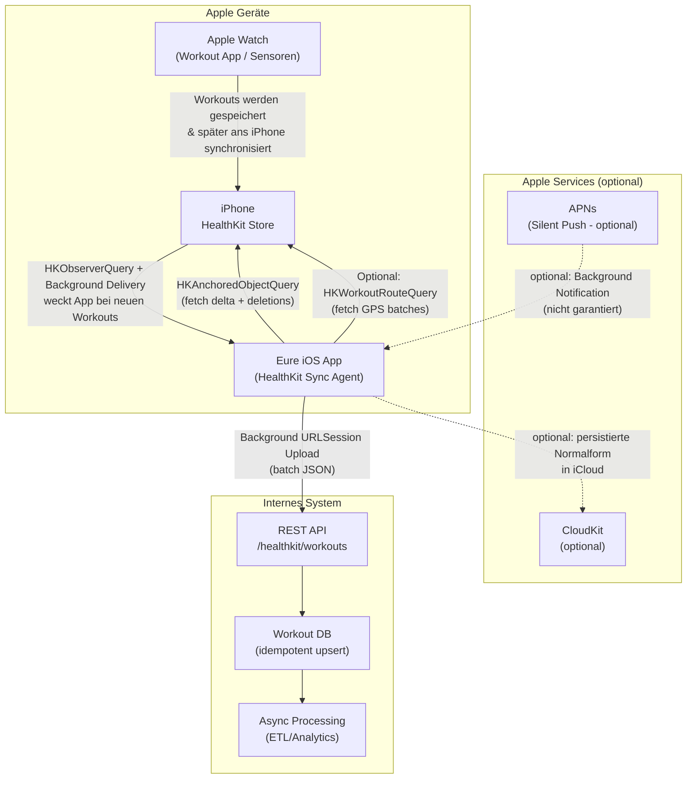

# Programmgesteuerter Zugriff auf Apple Workout-Daten und Hintergrund-Synchronisation

**Archived.** The project no longer uses a native iOS app or HealthKit for workout data. Workout data is synced via the **Strava API** instead. See [research-strava-api.md](./research-strava-api.md). The content below is kept for historical reference only.

---

## Executive Summary

Apple stellt **keine serverseitige/REST-basierte HealthKit-API** bereit, mit der ein Backend direkt (ohne iPhone/Watch als Gatekeeper) auf Workouts zugreifen könnte. HealthKit ist als **zentraler, lokaler** Speicher für Gesundheits- und Fitnessdaten auf **iPhone und Apple Watch** konzipiert; Apps greifen **nur mit expliziter Nutzerfreigabe** auf dem Gerät darauf zu. 

Für dein Ziel ("alle Laufen/Gehen-Workouts laden und mit internem System synchronisieren, möglichst im Hintergrund") ist die **praktikabelste und Apple-konforme Architektur**:  
Ein **iOS-Client** (optional zusätzlich watchOS-Komponente), der HealthKit-Daten **inkrementell** über **HKObserverQuery + Background Delivery** und **HKAnchoredObjectQuery** abruft und dann über **Background URLSession** zuverlässig an eure REST-API hochlädt. HealthKit kann eure App bei neuen Samples im Hintergrund wecken; danach müsst ihr die Änderungen aktiv nachladen (z. B. anchored query). 

Wichtige "Realitätsbremsen" (die man im Design einkalkulieren muss, sonst wird's in Produktion unzuverlässig):
- **Gerätesperre/Encryption:** Apple weist explizit darauf hin, dass der HealthKit-Store bei gesperrtem Gerät verschlüsselt ist - eure App kann dann **u. U. nicht lesen**, selbst wenn sie im Hintergrund läuft. Das konterkariert "100% Hintergrund ohne Nutzerinteraktion" bei bestimmten Zeitfenstern.   
- **Background Scheduling ist opportunistisch:** BGTaskScheduler-Zeitpunkte sind **nicht garantiert**; `earliestBeginDate` bedeutet "nicht früher", nicht "genau dann".   
- **Silent Push ist kein Trigger mit SLA:** Apple nennt Background Notifications "low priority" und **garantiert die Zustellung nicht**; sie können zudem gedrosselt werden. 

Empfehlung in einem Satz: **Event-getriebener Sync über HealthKit Background Delivery (Observer) + anchored incremental fetch + background Upload**, ergänzt um **periodische Fallback-Syncs** (BGAppRefresh/BGProcessing) und eine **idempotente Server-API**, die Duplikate/Resyncs sauber abfängt.

## Relevante Apple-Technologien und APIs

Die folgende Übersicht ist bewusst "engineering-tauglich": Zweck, harte Einschränkungen, Berechtigungen/Entitlements, OS-Verfügbarkeit und ob Hintergrundzugriff realistisch ist. Wo Apple es nicht klar spezifiziert, steht **„nicht angegeben"**.

| Technologie / API | Kurzbeschreibung | Einschränkungen (Load-bearing) | Berechtigungen / "Scopes" | iOS / iPadOS | watchOS | Hintergrundzugriff möglich? |
|---|---|---|---|---:|---:|---|
| **HealthKit (Framework)** | Zugriff/Sharing von Health- & Fitnessdaten über lokalen HealthKit-Store.  | On-device-Paradigma; stark nutzerkontrolliert.  | HealthKit Capability/Entitlement erforderlich.  | iOS 8.0+ (Framework)  | watchOS 2.0+  | **Ja, aber** Lesen kann bei Gerätesperre scheitern.  |
| **HKHealthStore** | Zentraler Einstieg: Authorization, Queries, Save/Delete.  | Ohne User-Authorization kein Zugriff; außerdem kann App nicht sicher erkennen, ob Read-Zugriff gewährt wurde.  | `requestAuthorization(...)` + Info.plist Usage Strings.  | iOS 8.0+ (indirekt; nicht angegeben auf Seite) | watchOS 2.0+ (indirekt; nicht angegeben) | Ja (Queries), aber abhängig von Systembedingungen/Encryption.  |
| **Authorization & Usage Strings** | Fein-granulare Freigabe pro Datentyp; separate Texte für Lesen/Schreiben (NSHealthShare/UpdateUsageDescription).  | No-UI im Hintergrund: Permission-Prompt nur im aktiven UI-Kontext sinnvoll. Außerdem erfährt App nicht zuverlässig "read allowed/denied".  | `NSHealthShareUsageDescription`, `NSHealthUpdateUsageDescription`.  | iOS: nicht angegeben (Dokument gilt für aktuelle iOS) | watchOS: nicht angegeben | Hintergrund: **Nein** (Consent Flow erfordert Nutzerinteraktion) |
| **HKWorkout / HKWorkoutType** | Workout-Sample: Dauer, Distanz, Energie; Container für weitere Samples.  | Workouts teilen sich einen Typ-Identifier; Filter über Predicates nötig; "Detaildaten" (HR, Strecke, etc.) oft als assoziierte Samples.  | Read-Permission auf `HKWorkoutType`.  | iOS 8.0+  | watchOS 2.0+  | Ja (Lesen), aber s. Encryption-Limit.  |
| **HKQuery.predicateForWorkouts(with:)** | Predicate zum Filtern nach Activity Type (z. B. `.running`, `.walking`).  | Bei Multi-Activity/Segmentierung ggf. unvollständig; alternative Predicates existieren.  | n/a (Teil von HealthKit) | iOS: nicht angegeben (Seite zeigt nur "iOS")  | watchOS: nicht angegeben | Ja (als Filter in Queries) |
| **HKSampleQuery** | Snapshot-Abfrage von Samples.  | Snapshot, nicht event-getrieben (ohne Observer/Anchored). | HealthKit Read-Permission auf den jeweiligen SampleType.  | iOS: nicht angegeben | watchOS: nicht angegeben | Bedingt (wenn App läuft; Trigger fehlt ohne Observer/Anchored). |
| **HKObserverQuery** | "Long-running" Monitoring; kann bei Änderungen wecken (mit Background Delivery).  | Observer liefert **keine Daten**, nur Signal; danach weitere Query nötig.  | HealthKit + Background Delivery; Completion Handler korrekt aufrufen.  | iOS: nicht angegeben | watchOS: nicht angegeben | **Ja**, über `enableBackgroundDelivery(...)`.  |
| **enableBackgroundDelivery(for:frequency:...)** | Aktiviert Background-Benachrichtigungen für Observer-Queries.  | Wenn Completion 3× "nicht sauber", stoppt HealthKit Background Updates.  | Ab iOS 15/watchOS 8 zusätzlich Entitlement nötig.  | iOS (API verfügbar): Mac Catalyst 13+; watchOS 8+ genannt.  | watchOS 8.0+  | Ja, aber diszipliniert implementieren (Completion/Backoff).  |
| **HealthKit Background Delivery Entitlement** (`com.apple.developer.healthkit.background-delivery`) | Entitlement, um Background Delivery für HKObserverQuery zu aktivieren.  | Ohne korrektes Provisioning kein Background Delivery. | Entitlements + Capabilities korrekt konfigurieren.  | iOS 15.0+  | watchOS 8.0+  | Ermöglicht Background Delivery (sonst nein).  |
| **HKAnchoredObjectQuery** | Liefert inkrementelle Änderungen seit Anchor inkl. Deletes.  | Deleted Objects sind **temporär**; zuverlässige Delete-Erkennung erfordert Observer + Background Delivery.  | HealthKit Read-Permission; Anchor persistent speichern.  | iOS: nicht angegeben | watchOS: nicht angegeben | Kann long-running sein; in Praxis als "Fetcher" nach Observer-Wakeup nutzen.  |
| **HKAnchoredObjectQueryDescriptor** (Swift Concurrency) | Swift-API für anchored queries; liest Änderungen nach Anchor.  | iOS/watchOS Mindestversion (relativ neu). | n/a | iOS 15.4+  | watchOS 8.5+  | Ja (wie anchored query), aber systemabhängig. |
| **HKDeletedObject** | Repräsentiert gelöschte HealthKit-Objekte; temporär im Store.  | Kann aus Speichergründen entfernt werden → Deletes zeitnah synchronisieren.  | n/a | iOS 11.0+ (metadata property)  | watchOS 4.0+ (metadata property)  | Ja; aber "kurzlebig" → robustes Design nötig.  |
| **HKWorkoutRoute / HKSeriesType.workoutRoute()** | Workout-Route als Series Sample; Locations werden batchweise gelesen.  | Große Datenmengen; zusätzliche Privacy-/Location-Themen. Lesen typ. über `HKWorkoutRouteQuery`.  | Read/Share Permission für **HKWorkout + HKWorkoutRoute**, plus Location Services, wenn ihr selbst Routen aufzeichnet.  | iOS 11.0+  | watchOS 4.0+  | Ja (lesen), aber heavy; und abhängig von Gerätesperre.  |
| **HKWorkoutRouteQuery** | Liest CLLocation-Batches aus einer Route.  | Asynchron, mehrere Callbacks; bis "done=true" alle Batches.  | HealthKit Route Read-Permission. | iOS: nicht angegeben | watchOS: nicht angegeben | Ja (wenn App läuft); Upload ggf. deferred. |
| **WatchConnectivity (Framework)** | Datentransfer Watch↔iPhone; queued Background Transfers.  | Nur zwischen paired Geräten; "live messaging" braucht `isReachable`; queued Transfers sind zuverlässiger.  | Watch App + iOS App; Session aktiv.  | iOS 9.0+  | watchOS 2.0+  | **Ja**: `transferUserInfo` läuft weiter auch wenn App suspendiert.  |
| **BackgroundTasks (BGTaskScheduler, BGAppRefreshTask, BGProcessingTask)** | Geplante Hintergrundfenster für Refresh/Processing.  | Scheduling nicht garantiert; `earliestBeginDate` ist keine SLA.  | Background Modes + Task IDs; ggf. Network/Power Requirements.  | iOS 13.0+  | watchOS: nicht angegeben (Framework ist iOS/iPadOS-first) | Ja, aber opportunistisch; ideal als Fallback.  |
| **URLSession Background Transfers** | Upload/Download laufen weiter, auch wenn App nicht aktiv ist; System-Prozess übernimmt.  | Delegate-basiert; Reconnect bei Relaunch; gut für robuste Uploads.  | Keine speziellen "Scopes"; aber ATS/HTTPS. | iOS: nicht angegeben (URLSession shared: iOS 7.0+)  | watchOS 2.0+ (URLSession shared)  | **Ja**, ideal für "Upload im Hintergrund".  |
| **UserNotifications Background Notifications (Silent Push)** | Remote Notification ohne UI; weckt App, um Content zu aktualisieren.  | **Nicht garantiert**, low priority, ggf. throttling.  | APNs + "remote-notification" Background Mode (iOS). (Details: nicht angegeben) | iOS: nicht angegeben | watchOS: nicht angegeben | Bedingt; nur als "Hint", nicht als Primärtrigger.  |
| **CloudKit** | Apple-Backend für App-Daten in iCloud-Containern.  | Nicht HealthKit selbst; ihr würdet Workouts "duplizieren" und dort ablegen. Server-Integration abhängig von gewähltem CloudKit-Zugang. | iCloud Capability + CloudKit Setup.  | iOS 8.0+  | watchOS 3.0+  | Ja (Syncmechanismen), aber Produkt-/Ops-Tradeoffs. |
| **Health Records / Clinical Health Records** | Zugriff auf klinische Records (FHIR) im HealthKit-Store.  | Sensitiv → spezielle Entitlements; App Review kann ablehnen, wenn nicht wirklich genutzt.  | Clinical Health Records Capability + `NSHealthClinicalHealthRecordsShareUsageDescription`.  | iOS: nicht angegeben | watchOS: nicht angegeben | Records können im Hintergrund aktualisiert werden (HealthKit-Mechanik).  |
| **WorkoutKit** | Modelle/Utilities zum Erstellen & Synchronisieren geplanter Workouts zur Workout-App.  | **Nicht** zum Auslesen existierender Apple-Workouts gedacht; eher "Workout Authoring". | n/a | iOS 17.0+  | watchOS 10.0+  | Hintergrund: nicht primär relevant (Sync zur Workout-App). |
| **Core Motion (CMPedometer)** | Systemgenerierte Geh-/Laufdaten (Steps, Distanz etc.), auch historisch.  | Kein Ersatz für "Workouts" als Objekte; eher Roh-/Aggregate. | Motion Permissions (nicht angegeben) | iOS 8.0+  | watchOS 2.0+  | Bedingt; abhängig von Sensor-/Systemregeln. |

**Sparring-Partner-Hinweis:** Wenn "alle aufgezeichneten Laufen/Gehen-Workouts" wirklich Apple Workout-App Workouts meint (nicht nur eure eigenen), dann führt technisch kein Weg an **HealthKit Read Access auf dem iPhone** vorbei. WatchConnectivity hilft nur, wenn ihr die Workouts **selbst** auf der Watch aufzeichnet oder wenigstens aktiv Daten von der Watch in eure iOS-App schiebt.

## Hintergrund-Synchronisation

### Lokales Triggern über HealthKit

**Goldstandard für "automatisch im Hintergrund":**
1) **HKObserverQuery** auf `HKWorkoutType` registrieren  
2) **Background Delivery aktivieren** (`enableBackgroundDelivery`)  
3) Im Observer-Callback sofort eine **HKAnchoredObjectQuery** ausführen, um neue/geänderte Workouts seit letztem Anchor zu bekommen. HealthKit weckt euch bei neuen Samples, liefert aber selbst nur das Signal - die Daten müsst ihr nachladen. 

**Zuverlässigkeitsklemme:** Wenn ihr den Observer-Completion Handler nicht sauber bedient, fährt HealthKit die Weckversuche per Backoff runter und kann Background Updates nach mehreren Fehlschlägen beenden.   
Praktisch heißt das: Im Observer-Callback **nicht** "lange" arbeiten. Stattdessen Work in eine lokale Queue legen, Upload starten (Background URLSession) und Completion zügig callen.

### Periodische Fallbacks: BGTaskScheduler

HealthKit-Push (Observer) ist event-getrieben, aber in der Praxis gibt es Fälle, wo ihr **Fallback-Runs** braucht (z. B. nach App-Update, Crash, Netzwerkproblemen). Dafür eignen sich:
- **BGAppRefreshTask** (kurz, "refresh content")   
- **BGProcessingTask** (länger, "minutes to complete")  - kann z. B. `requiresNetworkConnectivity = true` setzen. 

Aber: BGTask-Scheduling ist **nicht deterministisch**; `earliestBeginDate` garantiert nur "nicht früher".   
Daher eignet sich BGTaskScheduler **nicht** als alleiniger Near-Real-Time-Mechanismus, sondern als Fallback/Batcher.

### Upload im Hintergrund: URLSession background

Für die eigentliche Datenübertragung ist **Background URLSession** das robusteste Mittel in Apples Welt: Das System führt HTTP/HTTPS Upload/Downloads in einem separaten Prozess aus und kann Transfers fortsetzen, selbst wenn eure App suspendiert/terminiert ist. 

### Server-initiierte Flows: Silent Push (nur als "Hint")

Apple erlaubt Background Notifications (Silent Push), aber nennt sie explizit **low priority** und **nicht garantiert**; zu viele Notifications werden gedrosselt.   
Das ist wichtig: Wenn ihr "Server drückt Sync jetzt" als zentrale Steuerung plant, wird die Lösung **außerhalb eurer Kontrolle** unzuverlässig.

Ein sinnvoller Einsatz ist eher:
- Silent Push → "Bitte bald mal syncen"  
- Client macht beim nächsten Background-Fenster (HealthKit wakeup / BGTask / App-Open) einen anchored delta sync

### Watch-to-iPhone Transfer (wenn Watch-App existiert)

Wenn ihr eine **eigene** watchOS-App habt (z. B. eigenes Tracking per HKWorkoutSession), dann könnt ihr Daten von der Watch zur iPhone-App senden:
- **`transferUserInfo`** ist queued und soll sicher zugestellt werden; Transfer läuft weiter, auch wenn App suspendiert ist.   
- **`sendMessage`** ist "live", setzt `isReachable` voraus; von Watch aus kann es das iPhone im Hintergrund "aufwecken und erreichbar machen" (wenn Bedingungen stimmen).   

Das ist aber kein Ersatz für HealthKit-Lesen aus Apple Workout-App-Historie; es ist eine zusätzliche Pipeline für eure eigenen Daten.

### Vergleichstabelle empfohlener Ansätze

| Ansatz | Hintergrundfähig? | Zuverlässigkeit (realistisch) | Komplexität | Datenschutz-Risiko | Empfohlen für |
|---|---|---|---|---|---|
| **HealthKit Observer + anchored delta + Background URLSession Upload (iOS App)** | Ja (mit Einschränkungen)  | Hoch für Upload; Trigger gut, aber abhängig von OS/Unlock | Mittel-Hoch | Mittel (Health Data → "special category") | Standardlösung für kontinuierlichen Sync von Workouts |
| **Anchored Query only (ohne Observer Background Delivery)** | Teilweise  | Mittel: ihr müsst "irgendwie" Laufzeit bekommen | Mittel | Mittel | Nur, wenn ihr ohnehin oft App-Laufzeit habt (z. B. aktive Nutzung) |
| **BGAppRefresh/BGProcessing als Polling + anchored delta** | Ja  | Mittel-Niedrig: Scheduling nicht garantiert | Mittel | Mittel | Fallback / Periodischer "Sweep" |
| **Silent Push als Sync-Trigger** | Teilweise  | Niedrig: Zustellung nicht garantiert | Mittel (Push infra) | Mittel | Nur als "Hint" zusätzlich zu lokalem Trigger |
| **Watch-App trackt selbst + WatchConnectivity → iPhone → Server** | Ja  | Mittel-Hoch (queued transfers), aber paired/watch abhängig | Hoch | Mittel | Wenn ihr eigenes Workout-Erlebnis/Tracking baut |
| **Manueller Health Export (XML) + Upload** | Nein (manuell)  | Hoch (wenn Nutzer es macht), aber nicht automatisiert | Niedrig | Hoch (umfangreicher Datenexport) | Einmalimporte / Support-/Audit-Use-Cases |

## Serverseitiger Zugriff und REST

### Gibt es "HealthKit per REST" direkt von Apple?

Für Workouts: **praktisch nein**. Apple positioniert HealthKit als lokalen Repository-Ansatz auf iPhone/Apple Watch; Zugriff erfolgt über das HealthKit-Framework auf dem Gerät, nach Nutzerfreigabe.   
Zusätzlich verschlüsselt das Gerät den HealthKit-Store bei Sperre; das ist ein starkes Signal, dass Apple Health-Daten gerade **nicht** als Cloud-API mit serverseitigem Zugriff denkt. 

**Konsequenz:** Jede "REST-Synchronisation" braucht einen **Client-Teil**, der die Daten aus HealthKit liest und an euer Backend sendet.

### Workarounds / Alternativen (und ihre Tradeoffs)

**App als Gatekeeper (empfohlen):**  
Die iOS-App liest die gewünschten Workouts (HKWorkout + optional Route/Detail-Samples) und uploadet sie. Hintergrundausführung über HealthKit Background Delivery + URLSession background. 

**CloudKit als Zwischenablage (optional):**  
Statt euer eigenes Backend könnt ihr Workouts (bzw. euer Normalform-DTO) in einen CloudKit-Container schreiben. CloudKit ist dafür gemacht, App-Daten zwischen App und iCloud-Containern zu bewegen.   
Tradeoff: Ihr verschiebt Infrastruktur- und Identitätsfragen (Apple ID/iCloud) in die Produktarchitektur; außerdem bleibt es weiterhin ein **Client-Sync** (HealthKit → CloudKit), nicht serverseitiger HealthKit-Zugriff.

**Health Export XML (manuell, nicht background):**  
Apple erlaubt dem Nutzer, "alle Health- und Fitnessdaten" als XML zu exportieren.   
Für automatischen Sync ist das ungeeignet (aktive Nutzerinteraktion, massiver Datenumfang, schwer inkrementell).

**Health Records (klinische Daten):**  
Health Records beziehen sich auf klinische Records im FHIR-Format, benötigen spezielle Capabilities/Usage Strings und werden von HealthKit auch im Hintergrund aktualisiert.   
Für Lauf-/Geh-Workouts ist das thematisch **nicht** der richtige Mechanismus, aber relevant, wenn euer internes System klinische Daten integrieren soll.

### Datenschutz und Compliance: GDPR/HIPAA und Apple-Vorgaben

**Apple-Vorgaben (App Store/Policy):**
- Zugriff auf HealthKit ist entitlements-gesteuert und Apple nennt explizit Nutzungsrestriktionen; z. B. dürfen Apps Health-Daten nicht für Werbung verwenden und müssen eine Privacy Policy bereitstellen.   
- HealthKit-Guidance betont Privacy-Policy-Pflicht und "request access only when you need it."   

**GDPR (EU):**
- Gesundheitsdaten sind "special category data"; Verarbeitung ist grundsätzlich untersagt und braucht eine Ausnahme (typisch: **ausdrückliche Einwilligung** oder andere eng definierte Tatbestände).   
Das hat direkte Architekturfolgen: Datenminimierung, strikte Zweckbindung, Löschkonzepte, DPIA-Prüfung je nach Umfang/Risiko (DPIA-Details: nicht angegeben).

**HIPAA (USA, falls relevant):**
- HIPAA schützt "Protected Health Information (PHI)" bei Covered Entities und gibt Patienten Rechte; ob ihr HIPAA-pflichtig seid, hängt von eurem Status/Beziehungen ab. 

**Consent Flow (praktisch):**
- Ihr braucht eine **zweistufige Einwilligung**:  
  1) In-App Consent/Privacy (euer Vertrag) + Login  
  2) HealthKit Authorization Sheet (Apple) für konkrete Datentypen (`HKWorkoutType`, ggf. `HKSeriesType.workoutRoute()`).   
- Achtung: Aus Privacy-Gründen kann eure App nicht zuverlässig erkennen, ob Read-Zugriff gewährt ist; bei fehlender Read-Permission wirkt es "als gäbe es keine Daten". Das beeinflusst UX/Support und die "Fehlerdiagnose" in eurem Sync. 

## Implementierungs-Blueprint für eine robuste Sync-Lösung

### Zielarchitektur

**Designprinzipien (entscheidend für Produktionsreife):**
- **Inkrementell statt Vollsync**: anchored queries mit persistentem Anchor.   
- **Idempotent auf Serverseite**: HKObject UUID als natürlicher Schlüssel; Server muss Duplikate (Reinstall/Resync) "schlucken". HealthKit-Objekte haben eine UUID; eigene IDs kann man als Metadata (`HKMetadataKeyExternalUUID`) ergänzen.   
- **Delete-Handling ernst nehmen**: Deleted Objects sind temporär und können aus dem Store verschwinden; deshalb Deletes zeitnah übertragen und Sync-Fenster nicht "ewig" hinauszögern.   
- **Background-Lesen ist nicht garantiert**: bei Gerätesperre ggf. nicht lesbar → Implementierung muss "defer & retry" können.   
- **Upload robust machen**: Background URLSession für Netzwerktransfers.   

### Datenmodell für Workouts

**Minimaler, synchronisationsfreundlicher DTO für `HKWorkout` (Vorschlag):**

- `workout_uuid` (UUID; Primary Key) - kommt von `HKObject.uuid`.   
- `activity_type` (Enum/String; z. B. `running`, `walking`) - `HKWorkout.workoutActivityType`.   
- `start_at`, `end_at`, `duration_seconds` - aus HKSample/HKWorkout.   
- `total_distance_m` - `HKWorkout.totalDistance` (in Meter normalisieren).   
- `total_energy_kcal` - `HKWorkout.totalEnergyBurned` (falls vorhanden; nicht in allen Workouts).   
- `source_revision` (strukturiert: `source.bundleIdentifier`, `version`, etc.) - `HKObject.sourceRevision`.   
- `device` (optional: `HKDevice.localIdentifier`, model/manufacturer sofern verfügbar) - nützlich für Debugging, aber `localIdentifier` ist hardwarelokal und kann sich ändern.   
- `metadata` (whitelist!) - nur benötigte Keys; ggf. `HKMetadataKeyExternalUUID` für eure Korrelationen.   

**Optional (Route / Geo-Daten):**
- `route` als eigenes Sub-Objekt/Resource: Liste von (lat, lon, ts, altitude?) in Batches. Route-Daten können groß sein; Zugriff über `HKWorkoutRouteQuery` batchweise.   
- Privacy: Route ist hochsensibel (Wohnort/Bewegungsprofile). Reduktion/Generalisation (z. B. Downsampling, Bounding Boxes) spezifizieren (Policy: nicht angegeben).

### Inkrementeller Sync-Algorithmus

**Initial Sync**
1) User hat Authorization erteilt.
2) anchored query mit `anchor = nil` und sinnvoller `limit`-Chunking-Strategie. Apple sagt explizit: `anchor = nil` liest alle passenden Daten.   
3) Server-Upload in Batches (z. B. 100 Workouts pro Request) + lokale Progress-Persistenz  
4) Persistiere finalen Anchor.

**Delta Sync (laufend)**
- Trigger A: HealthKit Background Delivery (Observer) → anchored query ab "letztem Anchor".   
- Trigger B: BGAppRefresh/BGProcessing (Fallback) → anchored query ab letztem Anchor.   
- Trigger C: App Start/Foreground → anchored query + "drain queue".

**Filtering auf Laufen/Gehen**
- Entweder: anchored query ohne predicate und in Code filtern (robust, aber potente Datenmenge)  
- Oder: Predicates kombinieren (OR) mit `HKQuery.predicateForWorkouts(with: .running)` und `.walking`. Apple bietet dafür das convenience API. 

**Delete Sync**
- Nutzt die `deletedObjects` aus anchored query.   
- Achtet darauf, dass `HKDeletedObject` temporär ist; deshalb:  
  - Deletes zügig hochladen  
  - notfalls "tombstone" auf Server behalten  
  - bei Unsicherheit lieber "soft delete" statt physisch löschen (Policy-Frage)

### Fehlerbehandlung & Zuverlässigkeit

Für einen "wirklich" stabilen Sync müsst ihr an drei Stellen robust sein:

**HealthKit-Wakes**
- Completion Handler immer aufrufen; sonst drohen Backoff/Stop.   
- Wenn Lesen wegen Gerätesperre scheitert: Work markieren als "deferred" und bei nächster Gelegenheit erneut versuchen. (Apple beschreibt explizit diese Lesebeschränkung bei Lock.)   

**Upload-Pipeline**
- Background URLSession nutzen, weil der Transfer systemseitig fortgesetzt werden kann.   
- Idempotency-Key Header oder serverseitige Upserts (z. B. `workout_uuid` unique).  
- Exponential Backoff + Jitter; Abbruch bei 4xx (Auth/Schema) vs Retry bei 5xx/Netz.

**BGTaskScheduler**
- Erwartungsmanagement: nicht "jede Nacht um 02:00". `earliestBeginDate` ist keine Garantie.   
- BGProcessingTaskRequest kann Network Connectivity als Requirement angeben.   

### Token-, Consent- und Security-Design (Server-Sicht)

Da euer iOS-Client "Gesundheitsdaten" überträgt, ist ein sauberes Auth-Design Pflicht:

- **OAuth 2.0 Authorization Code Flow mit PKCE** (für Public Clients wie iOS Apps) als Standardmuster.   
- Bearer Tokens im `Authorization` Header nach RFC 6750 (aber dann Tokens gut schützen).   
- Aktuelle OAuth Security Best Practices: RFC 9700.   
- TLS 1.3 in Transit (oder best available).   
- At-Rest Encryption & Schlüsselmanagement: generische Leitlinien existieren (z. B. NIST zu Encryption Mechanismen für Daten at rest/in transit).   
- iOS-seitig: Refresh Token im Keychain; Anchor/Sync-State ebenfalls geschützt (konkret: nicht angegeben).

## Code- und Architekturbeispiele

### Mermaid Architektur-Flow



### Swift Snippet: Authorization + ObserverQuery + Background Delivery

> Hinweis: Das Snippet ist absichtlich "skelettiert", fokussiert auf die Mechanik. In Production würdest du Logging, Persistenz (Anchor/Queue), Retry und Threading sauber kapseln.

```swift
import HealthKit

final class WorkoutSyncAgent {

    private let store = HKHealthStore()
    private let workoutType = HKObjectType.workoutType()

    // Persistiert z.B. im Keychain oder verschlüsseltem File.
    private var anchor: HKQueryAnchor? = nil

    // MARK: - Setup

    func requestAuthorization() async throws {
        // Optional Route-Lesen:
        // let routeType = HKSeriesType.workoutRoute()  // iOS 11+ (Route Samples)
        // let typesToRead: Set<HKObjectType> = [workoutType, routeType]

        let typesToRead: Set<HKObjectType> = [workoutType]

        try await withCheckedThrowingContinuation { cont in
            store.requestAuthorization(toShare: nil, read: typesToRead) { success, error in
                if let error = error { cont.resume(throwing: error); return }
                cont.resume(returning: ())
            }
        }
        // Apple: App kann nicht zuverlässig feststellen, ob Read-Permission gewährt wurde;
        // fehlender Read-Zugriff wirkt wie "keine Daten". Handle UX entsprechend.
        // 
    }

    func startBackgroundWorkoutObservation() {
        // Filter nur Running/Walking (optional):
        let running = HKQuery.predicateForWorkouts(with: .running)
        let walking = HKQuery.predicateForWorkouts(with: .walking)
        let predicate = NSCompoundPredicate(orPredicateWithSubpredicates: [running, walking])
        // predicateForWorkouts(with:) liefert Activity-Type Predicate. 

        let query = HKObserverQuery(sampleType: workoutType, predicate: predicate) { [weak self] _, completion, error in
            guard let self else { completion(); return }
            if error != nil {
                // Fehler loggen; completion trotzdem zuverlässig aufrufen.
                completion()
                return
            }

            // HealthKit fordert: Nach Signal muss eine weitere Query folgen, um Daten zu erhalten. 
            self.fetchWorkoutDeltaAndEnqueueUpload(predicate: predicate) {
                // Wichtig: completion zeitnah callen, sonst backoff/stop risk. 
                completion()
            }
        }

        store.execute(query)

        // Background Delivery aktivieren: iOS 15+/watchOS 8+ erfordert Entitlement com.apple.developer.healthkit.background-delivery. 
        store.enableBackgroundDelivery(for: workoutType, frequency: .immediate) { success, error in
            // success/error loggen
        }
    }

    // MARK: - Delta Fetch

    private func fetchWorkoutDeltaAndEnqueueUpload(predicate: NSPredicate, done: @escaping () -> Void) {
        let anchored = HKAnchoredObjectQuery(
            type: workoutType,
            predicate: predicate,
            anchor: anchor,
            limit: HKObjectQueryNoLimit
        ) { [weak self] _, samples, deleted, newAnchor, error in
            guard let self else { done(); return }
            guard error == nil else { done(); return }

            // Anchor aktualisieren: HKAnchoredObjectQuery liefert Anchor für "last sample or deleted object". 
            if let newAnchor { self.anchor = newAnchor /* persistieren */ }

            let workouts = (samples as? [HKWorkout]) ?? []
            let deletedUUIDs = (deleted ?? []).map { $0.uuid }

            // 1) Workouts in lokale Outbox (DB/File) schreiben
            // 2) Upload-Queue anstoßen (Background URLSession)
            self.enqueueUpload(workouts: workouts, deletedUUIDs: deletedUUIDs)

            done()
        }

        // Optional: updateHandler setzen, wenn Query long-running laufen soll. 
        store.execute(anchored)
    }

    private func enqueueUpload(workouts: [HKWorkout], deletedUUIDs: [UUID]) {
        // Mapping + persistierte Upload-Outbox + Background URLSession
    }
}
```

**Warum das Design so aussieht (und nicht "nur anchored query polling"):** HealthKit beschreibt Background Deliveries als Mechanik, die euch im Hintergrund weckt; und betont gleichzeitig, dass ihr nach dem Wakeup eine weitere Query braucht, um Änderungen zu lesen. 

### Swift Snippet: Background URLSession Upload (minimal)

```swift
import Foundation

final class BackgroundUploader: NSObject, URLSessionTaskDelegate, URLSessionDataDelegate {

    static let shared = BackgroundUploader()

    private lazy var session: URLSession = {
        let config = URLSessionConfiguration.background(withIdentifier: "com.example.workout.upload")
        // System übernimmt Transfers in separatem Prozess; kann weiterlaufen wenn App suspendiert/terminiert. 
        config.sessionSendsLaunchEvents = true
        config.waitsForConnectivity = true
        return URLSession(configuration: config, delegate: self, delegateQueue: nil)
    }()

    func uploadJSON(_ data: Data, accessToken: String) {
        var request = URLRequest(url: URL(string: "https://api.example.com/v1/healthkit/workouts/batch")!)
        request.httpMethod = "POST"
        request.setValue("application/json", forHTTPHeaderField: "Content-Type")
        request.setValue("Bearer \(accessToken)", forHTTPHeaderField: "Authorization") // RFC 6750 

        let task = session.uploadTask(with: request, from: data)
        task.resume()
    }

    // MARK: URLSession delegate stubs (Production: robust implementieren)
    func urlSession(_ session: URLSession, task: URLSessionTask, didCompleteWithError error: Error?) {
        // Erfolgs-/Fehlerstatus in Outbox updaten, Retry etc.
    }
}
```

### Beispiel Server-API Spec (OpenAPI-style, minimal)

```yaml
openapi: 3.0.3
info:
  title: Internal HealthKit Workout Sync API
  version: "1.0"
servers:
  - url: https://api.example.com
paths:
  /v1/healthkit/workouts/batch:
    post:
      summary: Upsert workouts (idempotent)
      security:
        - bearerAuth: []
      requestBody:
        required: true
        content:
          application/json:
            schema:
              type: object
              required: [device_id, workouts]
              properties:
                device_id:
                  type: string
                sent_at:
                  type: string
                  format: date-time
                workouts:
                  type: array
                  items:
                    $ref: "#/components/schemas/Workout"
      responses:
        "200":
          description: Accepted and processed
          content:
            application/json:
              schema:
                type: object
                properties:
                  upserted:
                    type: integer
                  duplicates_ignored:
                    type: integer
                  errors:
                    type: array
                    items:
                      type: object
                      properties:
                        workout_uuid: { type: string, format: uuid }
                        message: { type: string }

  /v1/healthkit/workouts/deletions:
    post:
      summary: Soft-delete workouts by uuid
      security:
        - bearerAuth: []
      requestBody:
        required: true
        content:
          application/json:
            schema:
              type: object
              required: [device_id, deleted_workout_uuids]
              properties:
                device_id: { type: string }
                deleted_workout_uuids:
                  type: array
                  items: { type: string, format: uuid }
      responses:
        "200":
          description: Deletions recorded

components:
  securitySchemes:
    bearerAuth:
      type: http
      scheme: bearer
      bearerFormat: JWT
  schemas:
    Workout:
      type: object
      required: [workout_uuid, activity_type, start_at, end_at]
      properties:
        workout_uuid: { type: string, format: uuid }
        activity_type: { type: string, enum: [running, walking, other] }
        start_at: { type: string, format: date-time }
        end_at: { type: string, format: date-time }
        duration_seconds: { type: integer }
        total_distance_m: { type: number }
        total_energy_kcal: { type: number }
        source_revision:
          type: object
          properties:
            source_bundle_id: { type: string }
            source_version: { type: string }
        device:
          type: object
          properties:
            local_identifier: { type: string, nullable: true }
        metadata:
          type: object
          additionalProperties: true
```

**Server-Implementationsnotiz:** Bearer Tokens sind "bearer" - wer sie hat, kann sie nutzen; daher Storage/Transport streng schützen.  (Für moderne OAuth-Hardening-Regeln zusätzlich RFC 9700.) 

## Priorisierte Quellen, Risiken und konkrete Empfehlungen

### Priorisierte Quellen

**Apple Developer Documentation (Primärquellen)**
- HealthKit framework overview (lokales Repository auf iPhone/Watch).   
- Protecting user privacy (HealthKit Store verschlüsselt, Lesen im Background evtl. nicht möglich).   
- Executing Observer Queries / Background Deliveries (Wecken im Background + "dann weitere Query").   
- `enableBackgroundDelivery` inkl. Backoff/Stop-Verhalten bei fehlendem Completion Handling.   
- Executing Anchored Object Queries / HKAnchoredObjectQuery (delta + deletions + anchor).   
- HKDeletedObject (Temporarität; Delete-Strategie).   
- HKWorkout/HKWorkoutRoute/HKWorkoutRouteQuery & Route Reading (Batch-Locations).   
- HealthKit Background Delivery entitlement.   
- BackgroundTasks: BGProcessingTask/BGTaskRequest.earliestBeginDate ("not guaranteed").   
- URLSession background transfers (System-Prozess, weiter bei Suspend/Terminate).   
- UserNotifications: Pushing background updates (Silent Push nicht garantiert).   
- WatchConnectivity: `transferUserInfo`, `sendMessage` Wakeup-Eigenschaften.   
- Health Records (Clinical) + erforderliche Capability/Usage String + Hintergrundupdates.   

**Apple Security / Privacy (Primärquellen)**
- Apple Health Privacy White Paper (On-device encryption & access control).   
- Apple Platform Security Guide: "Protecting access to user's health data" (Entitlements/Restriktionen, kein Advertising).   

**WWDC / Apple Videos (Kontext)**
- WWDC20: Push Notifications primer (Kontext zu Push; Ergänzung zu Docs).   
- WWDC21: Build a workout app for Apple Watch (Workout-App Engineering Kontext).   

**Standards / Security**
- OAuth 2.0 / PKCE / Bearer / OAuth Security BCP / TLS 1.3.   
- NIST (Encryption Basics - Daten in transit/at rest mechanistisch).   

**Recht/Regulatorik**
- GDPR Art. 9 (Gesundheitsdaten als besondere Kategorie).   
- HHS: "What is PHI?" / HIPAA Privacy Rule Kontext.   

### Risiken, Limitierungen und offene Fragen

**Risiken/Limitierungen (technisch)**
- **"100% Hintergrund" ist nicht erreichbar**, wenn das Gerät gesperrt ist und Lesen aus HealthKit blockiert: Apple sagt ausdrücklich "may not be able to read … when it runs in the background" wegen Verschlüsselung bei Lock.   
- **Delete-Events können verloren gehen**, wenn ihr sie nicht zeitnah verarbeitet (HKDeletedObject ist temporär).   
- **Scheduling-Illusion**: BGTaskScheduler ist kein Cron; `earliestBeginDate` ist nicht garantiert.   
- **Silent Push nicht SLA-fähig**: Zustellung nicht garantiert und throttling möglich.   
- **Read-Permission Diagnostik**: App kann nicht sicher unterscheiden "keine Daten" vs "keine Read-Permission".   
- **Route-Daten sind schwergewichtig und hochsensibel**: technisch große Payloads (Batch-Locations) und privacy-kritisch (Bewegungsprofile).   

**Offene Fragen (die ihr vor Umsetzung konkret klären solltet)**
- Wollt ihr wirklich **GPS-Routen** synchronisieren oder reicht **Workout-Summary** (Start/Ende/Distanz/Energie)? Route erhöht Datenschutz-/Sicherheitsaufwand massiv.  
- Muss der Sync "near real-time" sein oder reicht "innerhalb von 24h"? Das bestimmt, wie aggressiv ihr Observer + BGProcessing kombiniert.  
- Wer ist "Nutzer" im internen System? (SSO/Device Binding; Token Lifecycle; Revocation).  
- Datenminimierung: Welche Felder sind business-kritisch? (Wenn ihr "alles" holt, steigt Risiko, App Review Angriffsfläche und Compliance-Aufwand.)

### Konkrete Empfehlungen

**Beste praktikable Lösung (für "Workouts von Apple Watch/iPhone in internes System")**
1) **iOS App als Gatekeeper** (HealthKit Read) + Login ins interne System  
2) **HKObserverQuery + `enableBackgroundDelivery`** als Event-Trigger für neue Workouts.   
3) **HKAnchoredObjectQuery** als inkrementeller Fetch (inkl. deletes) + persistierter Anchor.   
4) **Background URLSession** für Upload-Robustheit (Fortsetzung bei Suspend/Terminate).   
5) **Fallback**: BGAppRefresh/BGProcessing sweep 1-2×/Tag (ohne Timing-SLA).   
6) Server: **idempotent upserts**, Soft Deletes, starke Auth (OAuth2+PKCE), TLS 1.3, Audit-Logging.   

**Wenn "ohne Nutzerinteraktion" ein absolutes Muss ist:**  
Dann müsst ihr die Erwartung korrigieren: Apple's Lock-Encryption kann Read verhindern.   
Das realistische Ziel ist **"best effort im Hintergrund + garantiert beim nächsten Unlock/App-Open"**. Genau dafür braucht ihr Outbox + idempotenten Server.

**Wenn ihr maximale Zuverlässigkeit wollt (auch unabhängig vom HealthKit-Read im Lock):**
- Baut ggf. ein eigenes Tracking (HKWorkoutSession/HKLiveWorkoutBuilder) und sendet zumindest "Summary Events" von der Watch zur iPhone App via WatchConnectivity (queued).   
Das ist allerdings ein anderes Produkt (ihr ersetzt/ergänzt die Apple Workout-App), nicht nur "Daten abgreifen".

**Compliance/Privacy**
- Holt nur die Datentypen, die ihr wirklich braucht (Apple HIG/Guidance betont das).   
- Behandelt Workouts als Gesundheitsdaten (GDPR Art. 9 special category).   
- Dokumentiert Zweck, Löschfristen, Export/Portabilität, Zugriffskontrollen und Incident Response; Apple verlangt zudem Privacy-Policy-Transparenz. 